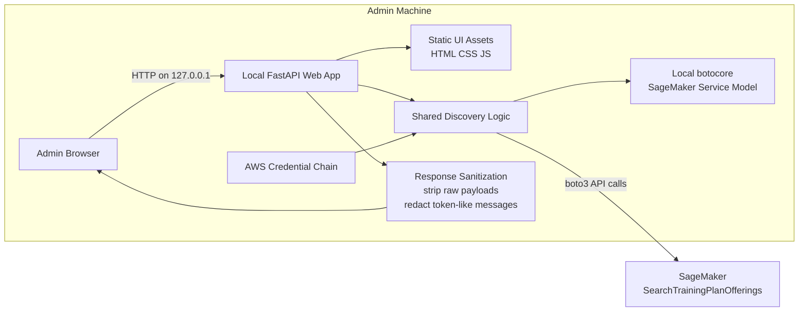
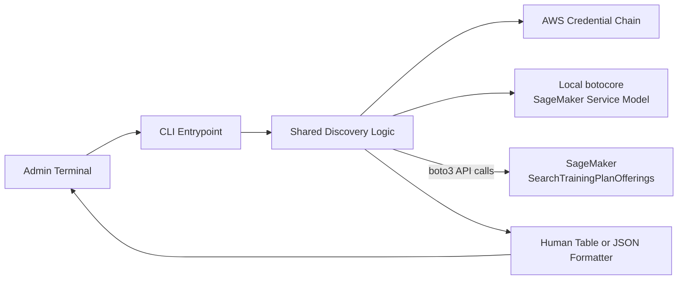
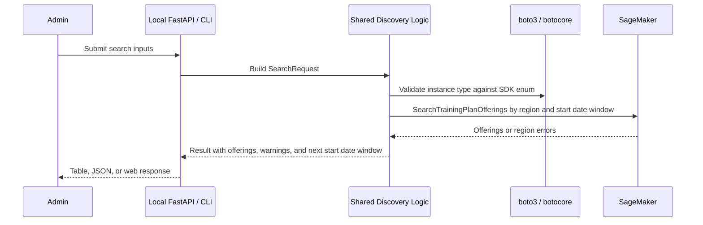
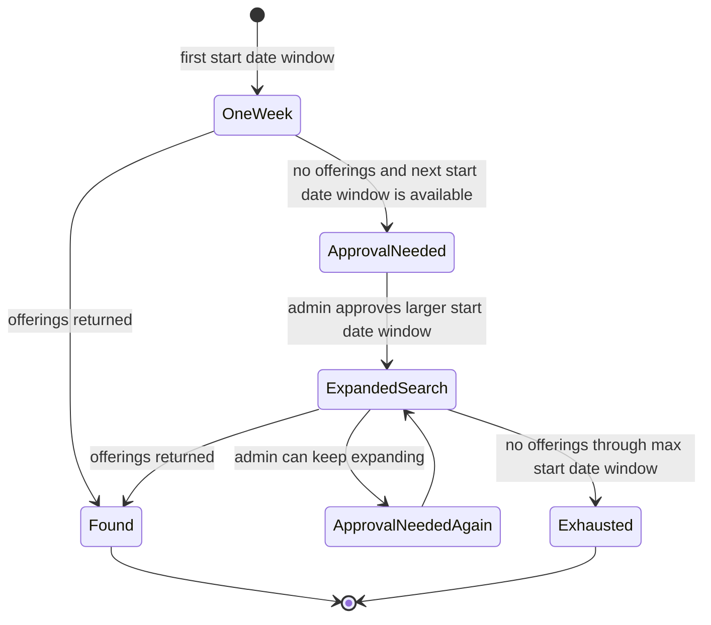
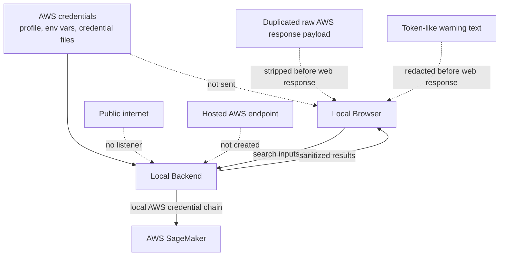

# Architecture

This project is a local-only admin tool. It provides a local FastAPI web UI and a CLI that both use the same shared discovery logic.

No AWS infrastructure is deployed by this repository. There is no public endpoint, hosted website, or cloud-hosted backend.

## Local Web App

## CLI Flow

## Request Flow

## Start Date Window Flow

## Security Boundary

## Operational Notes

- The local web app listens on `127.0.0.1`.
- Each admin uses their own local AWS identity and IAM permissions.
- The required AWS permission is `sagemaker:SearchTrainingPlanOfferings`.
- The frontend treats `offerings` as the primary table data and `best_offering` as the latest-start recommendation.
- `maximum_segments` defaults to `1`; higher values allow discontinuous multi-segment offerings.
